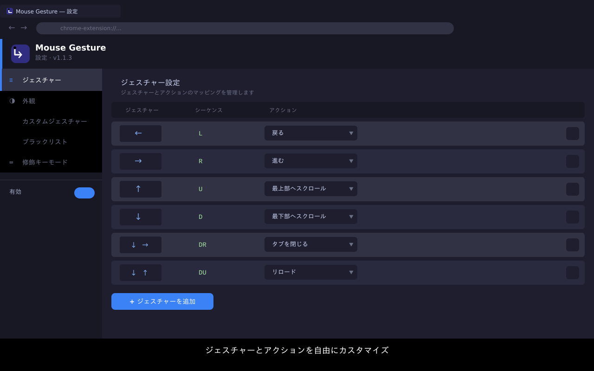

# Mouse Gesture

右クリックドラッグでブラウザを操作できるChrome拡張機能です。

---

## 機能

- **右クリックドラッグ**でジェスチャーを認識・実行
- **軌跡をリアルタイム表示**（キャンバスオーバーレイ）
- **グラフィカルな設定画面**でジェスチャーとアクションのマッピングを変更
- **カスタムジェスチャー**を設定画面上で描いて登録
- **ブラックリスト**機能で特定サイトを除外
- **通常メニューキー**でジェスチャーを一時的にスキップして右クリックメニューを表示
- **修飾キーモード**で右クリックに独自機能を持つサイトに対応（逆動作）
- **自動判定**でカスタム右クリックを持つサイトをセッション内で自動検出
- Linux / Windows / macOS に対応

## デフォルトジェスチャー

| ジェスチャー | 方向 | アクション |
|---|---|---|
| ← | 左 | 戻る |
| → | 右 | 進む |
| ↑ | 上 | 最上部へスクロール |
| ↓ | 下 | 最下部へスクロール |
| ↓→ | 下→右 | タブを閉じる |
| ↓↑ | 下→上 | リロード |

ジェスチャーのマッピングはすべて設定画面から変更・追加・削除できます。

## 割り当て可能なアクション

| アクション | 説明 |
|---|---|
| 戻る | ブラウザの履歴を1つ戻る |
| 進む | ブラウザの履歴を1つ進む |
| リロード | 現在のページを再読み込みする |
| タブを閉じる | 現在のタブを閉じる |
| 最上部へスクロール | ページ最上部へスムーズスクロール |
| 最下部へスクロール | ページ最下部へスムーズスクロール |
| リンクのテキストをコピー | ジェスチャー起点にあるリンクのテキストをクリップボードにコピー |
| リンクのURLをコピー | ジェスチャー起点にあるリンクのURLをクリップボードにコピー |
| メディアをダウンロード | ジェスチャー起点にある画像・動画をダウンロード |

## スクリーンショット

### ジェスチャー実行中（軌跡表示）

右クリックドラッグ中にキャンバス上へ軌跡と現在のアクション名が表示されます。

### 設定画面

各ジェスチャーの矢印ダイアグラムとアクションのドロップダウンが一覧表示され、直感的に設定を変更できます。

---

## インストール

### Chrome Web Store

### 手動インストール（デベロッパーモード）

1. [Releases](https://github.com/sasakitz/mouse-gesture/releases) から最新の `mouse-gesture-vX.X.X.zip` をダウンロード
2. ZIPを解凍
3. Chrome で `chrome://extensions` を開く
4. 右上の「デベロッパーモード」を有効化
5. 「パッケージ化されていない拡張機能を読み込む」をクリック
6. 解凍したフォルダを選択

---

## 使い方

1. 任意のWebページで**右クリックを押しながらドラッグ**
2. 軌跡と認識されたアクション名が画面に表示される
3. マウスボタンを離すとアクションが実行される

### 通常のコンテキストメニューを表示する

**Shift キーを押しながら右クリック**すると、ジェスチャーをスキップして通常の右クリックメニューが表示されます。

> Linux では `contextmenu` イベントの制約により、修飾キーとの組み合わせが通常メニューを開く唯一の手段です。使用するキーは設定画面から変更できます。

### カスタム右クリックを持つサイトでジェスチャーを使う

Figma・Google Maps・ゲームサイトなど、右クリックに独自の機能があるサイトでは、拡張機能が自動的に検出して修飾キーモードに切り替えます（初回右クリック時に判定）。その後は **通常メニューキー（デフォルト: Shift）を押しながら右クリックドラッグ**するとジェスチャーが発動します。

自動検出を待たずに設定したい場合は、設定画面の「修飾キーモード」セクションにサイトを登録してください。

### カスタムジェスチャーの追加

1. 拡張機能アイコンをクリック → 「設定を開く」
2. 「ジェスチャー設定」セクションの「カスタムジェスチャーを追加」へ
3. キャンバス上でジェスチャーを描く
4. アクションを選択して「追加」

---

## 設定

ポップアップの「設定を開く」から設定ページを開けます。

### 外観設定

| 設定項目 | 説明 |
|---|---|
| ジェスチャーを有効にする | 拡張機能全体のON/OFF |
| 軌跡の色 | 描画される軌跡の色 |
| 軌跡の透明度 | 0〜100% |
| 軌跡の太さ | 1〜10px |
| 最小ドラッグ距離 | ジェスチャーと判定する最小移動距離（px） |
| 通常メニューキー | 右クリック時にジェスチャーをスキップして通常メニューを表示する修飾キー（Shift / Ctrl / Alt / Super） |

### ブラックリスト

特定のサイトでジェスチャーを無効にできます。ドメイン（例: `example.com`）またはURLプレフィックス（例: `https://example.com/app`）を登録してください。サブドメインも自動的に対象になります。

### 修飾キーモード

右クリックに独自の機能（カスタムメニューやパン操作など）を持つサイトを登録すると、**通常の右クリックはサイト本来の動作**になり、**通常メニューキー（デフォルト: Shift）を押しながら右クリックドラッグ**したときのみジェスチャーが発動する逆モードになります。

ドメインまたはURLプレフィックスの書式はブラックリストと同じです。

#### 自動判定

修飾キーモードリストへの手動登録なしに、ページがカスタム右クリックを持つかどうかを自動検出します。

- `contextmenu` イベントをページ側が `preventDefault()` で処理していることをバブルフェーズで検出
- 検出されたサイトはセッション（タブのライフタイム）内で自動的に修飾キーモードで動作
- 永続的に適用したい場合は「修飾キーモード」リストに手動で追加してください

> **Linux の場合:** `contextmenu` が `mousedown` 直後に発火する特性上、未判定サイトへの初回右クリック時に1度だけメニューが表示されてから自動判定されます。

設定は `chrome.storage.sync` に保存され、Chromeアカウントでログイン中のデバイス間で同期されます。

---

## 技術仕様

- **Manifest V3**
- コンテントスクリプトによるジェスチャー検出（`mousedown` / `mousemove` / `mouseup`）
- Canvas 2D API によるリアルタイム軌跡描画
- Service Worker によるタブ操作（`chrome.tabs.goBack` / `goForward` / `reload` / `remove`）

### Linux対応

Linux（GTK版Chrome）では `contextmenu` イベントが `mousedown` と同タイミングで発火するため、イベントキャプチャフェーズでの制御とジェスチャー状態フラグの組み合わせで対応しています。通常メニューを表示したい場合は、設定で指定した修飾キー（デフォルト: Shift）を押しながら右クリックしてください。

---

## ライセンス

[MIT License](LICENSE)
